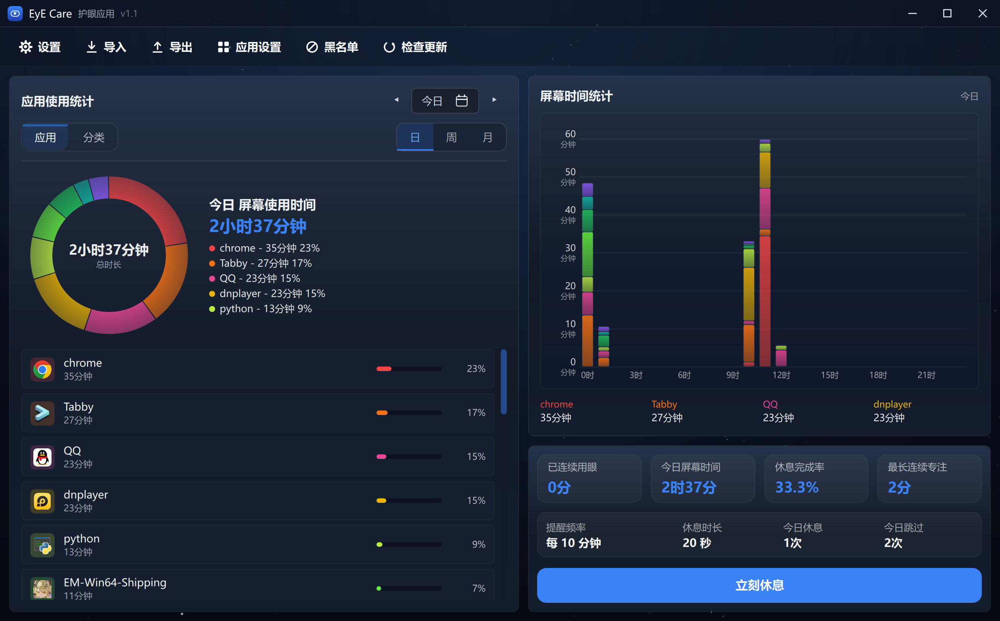

# EyE Care

**Windows 护眼提醒 + 应用使用时长统计工具**

在后台安静地记录你每天用了哪些程序、用了多久，在你连续盯屏达到阈值后弹出休息提醒，帮你养成定期休息的习惯。所有数据保存在本地，不联网。

---

## 功能

- **使用时长统计** — 自动追踪各前台应用的使用时间，按日 / 周 / 月查看，支持任意日期区间
- **休息提醒** — 连续用眼达到设定时长后弹出右下角通知气泡，可「立刻休息」或「跳过本轮」
- **全屏休息遮罩** — 支持多屏，倒计时结束后自动退出

---

## 快速开始

### 下载使用

前往 [Releases](../../releases) 下载最新版 `EyE Care.exe`，解压后直接双击运行，无需安装 Python 或任何依赖。

### 从源码运行

```bash
git clone https://github.com/Suisyokuyuu/Eye-care.git
cd Eye-care
pip install -r requirements.txt
python main.py
```

常用启动参数：

```bash
python main.py --debug          # 显示调试日志
python main.py --data-dir ./dev_data   # 指定数据目录
python main.py --no-single      # 允许多实例（开发时用）
```

### 改版本号 / 打包

双击项目根目录的 **`menu.bat`**：

| 选项 | 说明 |
|------|------|
| `[1] 修改版本号` | 写 `eye_care/version.py`，并自动重新生成 `version_info.txt` |
| `[2] 打包 exe` | 可顺便改版本号；打包前自动同步版本、检查依赖，产出 `dist/EyE Care/` |
| `[3] 清理构建产物` | 删除 `dist/`、`build/`、所有 `__pycache__` |

版本号的唯一真源是 `eye_care/version.py`；`version_info.txt`（exe 属性里显示的版本）
是生成物，**不要手改**。命令行等价写法：

```bash
python scripts/sync_version.py 1.4.0   # 改版本号并重新生成
python scripts/sync_version.py         # 只按现有版本重新生成
```

---

## 界面预览



---

## 使用手册

详见 [`docs/使用手册.md`](docs/使用手册.md)，包含：

- 主界面各区域说明
- 休息提醒配置
- 系统托盘操作
- 数据备份与迁移
- 常见问题解答

---

## 系统要求

| 项目 | 要求 |
|------|------|
| 操作系统 | Windows 10 / 11（x64） |
| 运行环境 | 打包版无需额外安装；源码版需 Python 3.12+ |

---

## 技术栈

- **Python 3.12** + **PySide6**（Qt 6）
- **Qt Quick / QML** 原生 UI
- 本地 JSONL + WAL 数据存储
- PyInstaller 打包

---

## 许可证

[MIT](LICENSE)

---
